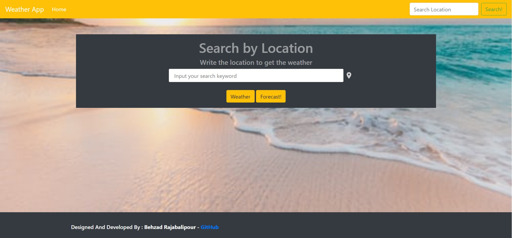
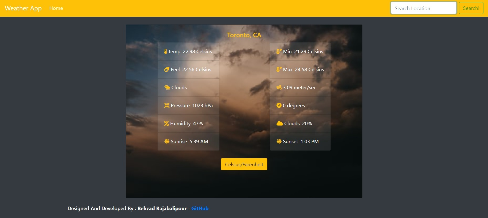
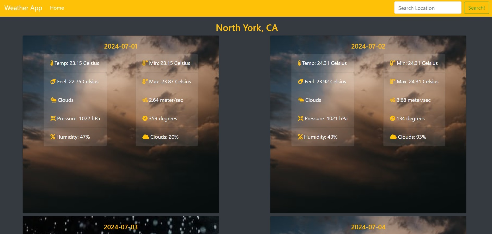

# WeatherApp

##### A weather app built with JavaScript that uses the OpenWeatherMap API, enabling users to search for and view the forecast in cities around the globe.

## Live Preview

### [https://weather-forecast.behzadportfolio.com/](https://weather-forecast.behzadportfolio.com/) :point_left:

Landing Page:

Actual Weather:

5-Day Forecast:

## Built With

- WEBPACK
- GITHUB ACTIONS
- JAVASCRIPT
- BOOTSTRAP
- HTML 
- CSS
- NPM

### Usage
- To set up a local copy, follow these simple steps.

Clone the repository to your local machine and navigate to the folder.

### Prerequisites

- A modern, up-to-date browser.

### Running Tests

- There are no automated tests for this project.

## Future Enhancements

- Add additional features and a contact page.
